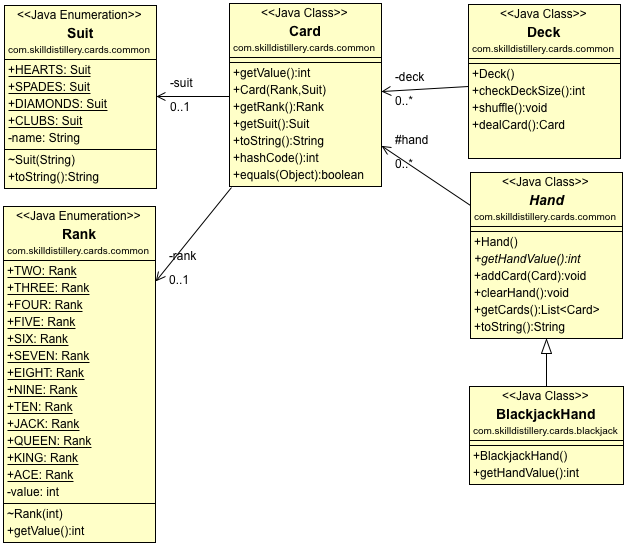

## Blackjack Project

### Skill Distillery Week 4 Homework

### Description
BlackJackTable is a simple command line version of the well-known game of 21. There is only one rule, if the house can hit, the house must hit. The house can hit if the house hand value is less than 17. The game is over if any player hand is equal to 21 (BLACKJACK), or greater than 21 (BUST). The game is also over if all hands are equal and the house can not hit (PUSH). The winner is the player with 21, or player with the greatest hand value less than 21.

Note:
This implementation doesnt let the player hit if there is a push and the house can't hit. Its a freebie.

## Lessons Learned
A lot of practice on calling/writing methods, extends and implements, experimented with constants, implementing enums. Observed that just getting in the reps of writing the code has made me less worried about "feeling ready" to write code, and just tried writing it. Went down about four "rabbit holes" I think largely due to errors in, what im calling "APIE considerations". Need to first "think about it in english" instead of going straight to code. Substantial time wasted trying out variables. Simply calling the method would have saved a lot of time. Substantial time spent on stretch goal methods for insurance, bets, and pays, that did not end up in the final table as they were not working. Writing tests would have probably been a saving grace.

Areas to Improve: 
"working" before "refactoring"
APIE
Develop (Writes Tests)
Develop (Draws UML) 
Develop (Workflow)

### Technologies Used
Java, Eclipse, vi, git

### UML Diagram
